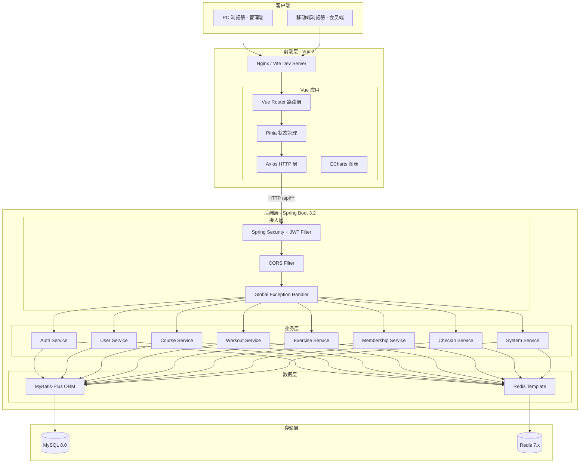
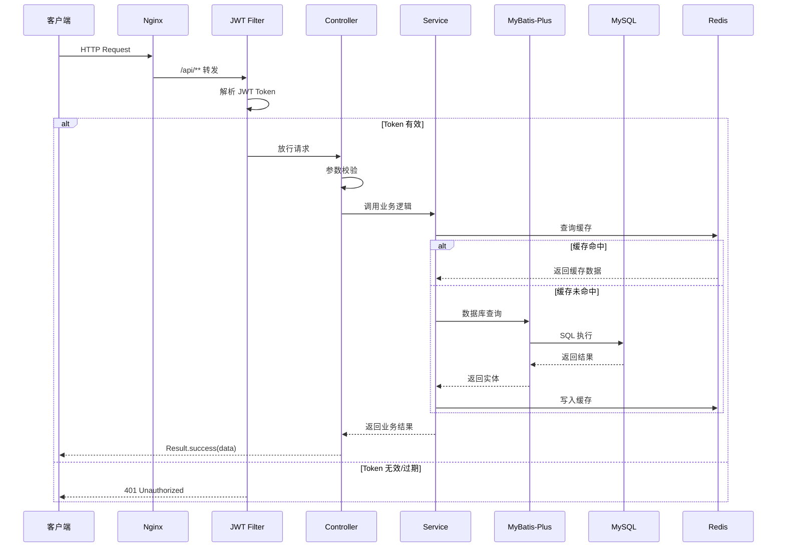
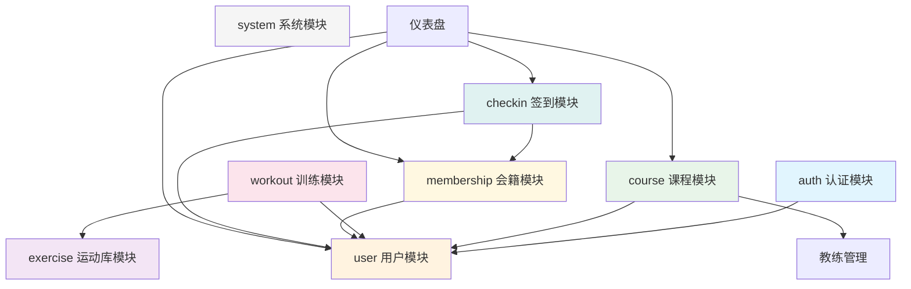
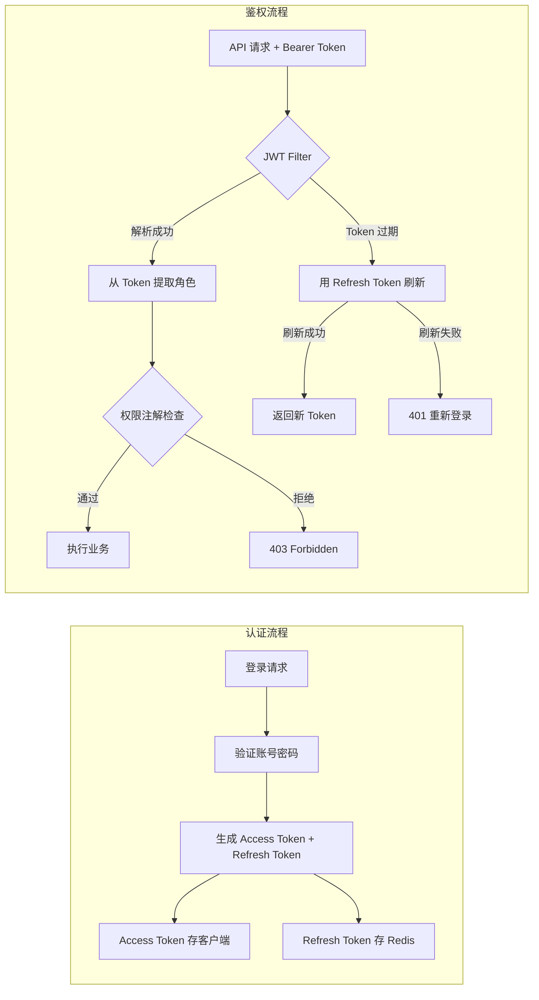

# FitPro 系统架构设计

## 1. 整体架构图



## 2. 请求处理流程



## 3. 模块依赖关系



## 4. 安全架构



## 5. 前端架构

```mermaid
graph TB
    subgraph 路由层
        R1[/ - 登录页]
        R2[/admin - 管理端布局]
        R3[/app - 会员端布局]
    end

    subgraph 管理端页面
        R2 --> P1[Dashboard 仪表盘]
        R2 --> P2[会员管理]
        R2 --> P3[教练管理]
        R2 --> P4[课程管理]
        R2 --> P5[运动库管理]
        R2 --> P6[系统管理]
    end

    subgraph 会员端页面
        R3 --> P7[个人中心]
        R3 --> P8[课程预约]
        R3 --> P9[训练计划]
        R3 --> P10[签到打卡]
    end

    subgraph 状态管理 Pinia
        S1[useAuthStore]
        S2[useUserStore]
        S3[useCourseStore]
    end

    subgraph API 层
        A1[authApi]
        A2[userApi]
        A3[courseApi]
        A4[workoutApi]
        A5[exerciseApi]
        A6[membershipApi]
    end

    P1 & P2 & P3 & P4 & P5 & P6 & P7 & P8 & P9 & P10 --> S1 & S2 & S3
    S1 & S2 & S3 --> A1 & A2 & A3 & A4 & A5 & A6
```
