# FitPro 数据库 Schema 设计

## ER 关系图

```mermaid
erDiagram
    %% ==================== 用户相关 ====================
    sys_user {
        bigint id PK "主键"
        varchar username "用户名/手机号"
        varchar password "BCrypt 加密密码"
        varchar nickname "昵称"
        varchar avatar "头像 URL"
        varchar email "邮箱"
        varchar phone "手机号"
        tinyint gender "性别 0未知 1男 2女"
        date birthday "生日"
        varchar role "角色 SUPER_ADMIN/COACH/MEMBER"
        tinyint status "状态 0禁用 1启用"
        datetime created_at "创建时间"
        datetime updated_at "更新时间"
        tinyint deleted "逻辑删除 0否 1是"
    }

    %% ==================== 身体数据 ====================
    body_record {
        bigint id PK "主键"
        bigint user_id FK "用户ID"
        decimal weight "体重 kg"
        decimal height "身高 cm"
        decimal body_fat "体脂率 %"
        decimal bmi "BMI"
        decimal chest "胸围 cm"
        decimal waist "腰围 cm"
        decimal hip "臀围 cm"
        date record_date "记录日期"
        varchar remark "备注"
        datetime created_at "创建时间"
    }

    %% ==================== 会籍相关 ====================
    membership_card {
        bigint id PK "主键"
        varchar card_name "卡种名称"
        varchar card_type "类型 MONTH/QUARTER/YEAR/TIMES"
        int duration_days "有效天数"
        int total_times "总次数(次卡)"
        decimal price "价格"
        tinyint status "状态 0下架 1上架"
        datetime created_at "创建时间"
        datetime updated_at "更新时间"
    }

    member_membership {
        bigint id PK "主键"
        bigint user_id FK "会员ID"
        bigint card_id FK "卡种ID"
        datetime start_date "开始日期"
        datetime end_date "到期日期"
        int remaining_times "剩余次数"
        varchar status "状态 ACTIVE/FROZEN/EXPIRED/CANCELLED"
        datetime frozen_at "冻结时间"
        datetime created_at "创建时间"
        datetime updated_at "更新时间"
    }

    %% ==================== 签到 ====================
    check_in {
        bigint id PK "主键"
        bigint user_id FK "会员ID"
        bigint membership_id FK "会籍ID"
        datetime check_in_time "签到时间"
        varchar check_in_type "签到方式 MANUAL/QR_CODE"
        datetime created_at "创建时间"
    }

    %% ==================== 运动库 ====================
    exercise_category {
        bigint id PK "主键"
        varchar name "分类名称"
        varchar icon "图标"
        int sort_order "排序"
        datetime created_at "创建时间"
    }

    exercise {
        bigint id PK "主键"
        bigint category_id FK "分类ID"
        varchar name "动作名称"
        varchar description "动作描述"
        varchar muscle_group "目标肌群"
        varchar equipment "所需器械"
        varchar difficulty "难度 BEGINNER/INTERMEDIATE/ADVANCED"
        varchar video_url "教学视频URL"
        varchar image_url "示意图URL"
        datetime created_at "创建时间"
        datetime updated_at "更新时间"
    }

    %% ==================== 训练相关 ====================
    workout_template {
        bigint id PK "主键"
        varchar name "模板名称"
        varchar description "描述"
        bigint coach_id FK "创建教练ID"
        varchar target_type "目标 FAT_LOSS/MUSCLE_GAIN/SHAPE"
        varchar difficulty "难度"
        datetime created_at "创建时间"
        datetime updated_at "更新时间"
    }

    workout_template_item {
        bigint id PK "主键"
        bigint template_id FK "模板ID"
        bigint exercise_id FK "动作ID"
        int sets "组数"
        int reps "每组次数"
        int rest_seconds "组间休息秒数"
        int sort_order "排序"
    }

    workout_plan {
        bigint id PK "主键"
        bigint user_id FK "会员ID"
        bigint coach_id FK "教练ID"
        varchar name "计划名称"
        varchar description "描述"
        date start_date "开始日期"
        date end_date "结束日期"
        varchar status "状态 ACTIVE/COMPLETED/CANCELLED"
        datetime created_at "创建时间"
        datetime updated_at "更新时间"
    }

    workout_plan_day {
        bigint id PK "主键"
        bigint plan_id FK "计划ID"
        int day_of_week "星期几 1-7"
        varchar name "训练日名称(如:胸+三头)"
        bigint template_id FK "关联模板ID(可选)"
    }

    workout_plan_day_item {
        bigint id PK "主键"
        bigint plan_day_id FK "训练日ID"
        bigint exercise_id FK "动作ID"
        int sets "组数"
        int reps "每组次数"
        decimal weight "建议重量 kg"
        int rest_seconds "组间休息秒数"
        int sort_order "排序"
    }

    workout_record {
        bigint id PK "主键"
        bigint user_id FK "会员ID"
        bigint plan_day_id FK "训练日ID(可选)"
        varchar name "训练名称"
        datetime start_time "开始时间"
        datetime end_time "结束时间"
        int duration_minutes "时长(分钟)"
        int total_volume "总训练量 kg"
        varchar note "备注"
        datetime created_at "创建时间"
    }

    workout_record_item {
        bigint id PK "主键"
        bigint record_id FK "训练记录ID"
        bigint exercise_id FK "动作ID"
        int set_number "第几组"
        int reps "次数"
        decimal weight "重量 kg"
        int duration_seconds "时长(有氧用)"
        tinyint completed "是否完成"
    }

    %% ==================== 课程相关 ====================
    course {
        bigint id PK "主键"
        varchar name "课程名称"
        varchar description "课程描述"
        varchar cover_image "封面图"
        varchar course_type "类型 YOGA/BOXING/SPINNING/HIIT/OTHER"
        int duration_minutes "课程时长(分钟)"
        int max_capacity "最大容量"
        tinyint status "状态 0下架 1上架"
        datetime created_at "创建时间"
        datetime updated_at "更新时间"
    }

    course_schedule {
        bigint id PK "主键"
        bigint course_id FK "课程ID"
        bigint coach_id FK "教练ID"
        date schedule_date "排课日期"
        time start_time "开始时间"
        time end_time "结束时间"
        varchar location "上课地点"
        int current_count "当前预约人数"
        int max_capacity "最大容量"
        varchar status "状态 UPCOMING/ONGOING/FINISHED/CANCELLED"
        datetime created_at "创建时间"
    }

    course_booking {
        bigint id PK "主键"
        bigint user_id FK "会员ID"
        bigint schedule_id FK "排课ID"
        varchar status "状态 BOOKED/CANCELLED/ATTENDED/ABSENT"
        datetime booked_at "预约时间"
        datetime cancelled_at "取消时间"
        datetime created_at "创建时间"
    }

    %% ==================== 系统相关 ====================
    sys_announcement {
        bigint id PK "主键"
        varchar title "标题"
        text content "内容"
        varchar type "类型 NOTICE/ACTIVITY/MAINTENANCE"
        tinyint is_top "是否置顶"
        tinyint status "状态 0草稿 1发布"
        bigint created_by FK "创建人ID"
        datetime publish_at "发布时间"
        datetime created_at "创建时间"
        datetime updated_at "更新时间"
    }

    sys_operation_log {
        bigint id PK "主键"
        bigint user_id FK "操作人ID"
        varchar username "操作人用户名"
        varchar module "操作模块"
        varchar operation "操作类型"
        varchar method "请求方法"
        varchar url "请求URL"
        varchar ip "IP地址"
        int duration "耗时ms"
        tinyint status "状态 0失败 1成功"
        text params "请求参数"
        text result "返回结果"
        datetime created_at "操作时间"
    }

    %% ==================== 关系定义 ====================
    sys_user ||--o{ body_record : "记录身体数据"
    sys_user ||--o{ member_membership : "持有会籍"
    membership_card ||--o{ member_membership : "卡种"
    sys_user ||--o{ check_in : "签到"
    member_membership ||--o{ check_in : "关联会籍"
    exercise_category ||--o{ exercise : "分类包含"
    sys_user ||--o{ workout_template : "教练创建"
    workout_template ||--o{ workout_template_item : "包含动作"
    exercise ||--o{ workout_template_item : "被引用"
    sys_user ||--o{ workout_plan : "会员的计划"
    workout_plan ||--o{ workout_plan_day : "包含训练日"
    workout_plan_day ||--o{ workout_plan_day_item : "包含动作"
    exercise ||--o{ workout_plan_day_item : "被引用"
    sys_user ||--o{ workout_record : "训练记录"
    workout_record ||--o{ workout_record_item : "包含组"
    exercise ||--o{ workout_record_item : "被引用"
    course ||--o{ course_schedule : "排课"
    sys_user ||--o{ course_schedule : "教练授课"
    course_schedule ||--o{ course_booking : "预约"
    sys_user ||--o{ course_booking : "会员预约"
    sys_user ||--o{ sys_announcement : "创建公告"
    sys_user ||--o{ sys_operation_log : "操作日志"
```

## 表清单汇总

| 序号 | 表名 | 说明 | 所属模块 |
|------|------|------|----------|
| 1 | sys_user | 用户表 | 用户模块 |
| 2 | body_record | 身体数据记录 | 个人中心 |
| 3 | membership_card | 会员卡种 | 会籍模块 |
| 4 | member_membership | 会员会籍 | 会籍模块 |
| 5 | check_in | 签到记录 | 签到模块 |
| 6 | exercise_category | 运动分类 | 运动库 |
| 7 | exercise | 运动动作 | 运动库 |
| 8 | workout_template | 训练模板 | 训练模块 |
| 9 | workout_template_item | 训练模板动作 | 训练模块 |
| 10 | workout_plan | 训练计划 | 训练模块 |
| 11 | workout_plan_day | 训练计划-日 | 训练模块 |
| 12 | workout_plan_day_item | 训练计划-日-动作 | 训练模块 |
| 13 | workout_record | 训练记录 | 训练模块 |
| 14 | workout_record_item | 训练记录-组 | 训练模块 |
| 15 | course | 课程 | 课程模块 |
| 16 | course_schedule | 排课 | 课程模块 |
| 17 | course_booking | 课程预约 | 课程模块 |
| 18 | sys_announcement | 系统公告 | 系统模块 |
| 19 | sys_operation_log | 操作日志 | 系统模块 |
