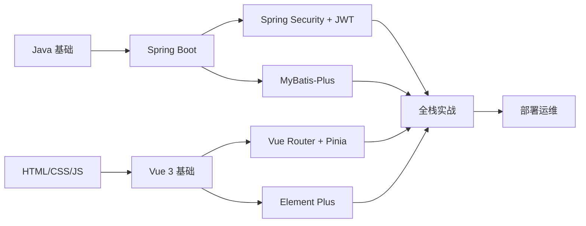
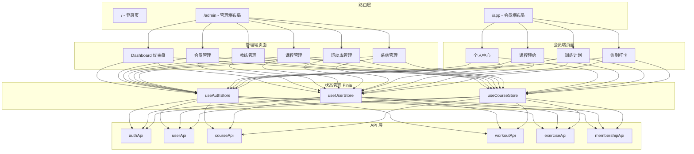

# FitPro 全栈开发学习计划

## 学习路线图

---

## 阶段一：后端基础 (配合 Phase 1-2)

### 1.1 Spring Boot 核心

### 1.2 MyBatis-Plus

| 学习内容 | 关键知识点 | 实践目标 |
|----------|-----------|----------|
| 基础 CRUD | BaseMapper, IService | 单表增删改查 |
| 条件构造器 | QueryWrapper, LambdaQueryWrapper | 复杂条件查询 |
| 分页插件 | PaginationInnerInterceptor | 实现分页查询接口 |
| 自动填充 | MetaObjectHandler | 自动填充 createdAt/updatedAt |
| 逻辑删除 | @TableLogic | 配置全局逻辑删除 |

### 1.3 Spring Security + JWT

| 学习内容 | 关键知识点 | 实践目标 |
|----------|-----------|----------|
| Security 过滤链 | SecurityFilterChain, 放行配置 | 配置白名单和角色权限 |
| JWT 原理 | Header.Payload.Signature | 实现 Token 生成和解析 |
| 自定义过滤器 | OncePerRequestFilter | 实现 JWT 认证过滤器 |
| 密码加密 | BCryptPasswordEncoder | 注册时加密, 登录时校验 |
| Redis 缓存 | RedisTemplate, Token 存储 | 实现 Token 黑名单/刷新 |

---

## 阶段二：前端基础 (配合 Phase 1-2)

### 2.1 Vue 3 核心

| 学习内容 | 关键知识点 | 实践目标 |
|----------|-----------|----------|
| 组合式 API | setup, ref, reactive, computed | 用 Composition API 写组件 |
| 生命周期 | onMounted, onUnmounted | 理解组件生命周期 |
| 组件通信 | props, emit, provide/inject | 父子组件数据传递 |
| 模板语法 | v-if, v-for, v-model, v-bind | 动态渲染列表和表单 |

### 2.2 Vue 生态

| 学习内容 | 关键知识点 | 实践目标 |
|----------|-----------|----------|
| Vue Router | 路由配置, 导航守卫, 动态路由 | 实现登录跳转和权限路由 |
| Pinia | defineStore, state, actions | 实现用户状态管理 |
| Axios | 拦截器, 请求封装 | 封装统一请求工具 |
| Element Plus | 表格, 表单, 弹窗, 消息 | 搭建管理端页面 |

---

## 阶段三：业务实战 (配合 Phase 3-4)

### 3.1 后端进阶

| 学习内容 | 关键知识点 | 实践目标 |
|----------|-----------|----------|
| 复杂业务逻辑 | 事务管理, 并发控制 | 课程预约的容量控制 |
| 多表关联 | MyBatis XML, 联表查询 | 训练计划的多层嵌套查询 |
| AOP 切面 | @Aspect, 自定义注解 | 实现操作日志自动记录 |
| 数据校验 | @Valid, 自定义校验器 | 接口参数校验 |
| 接口文档 | Knife4j 注解 | 生成完整 API 文档 |

### 3.2 前端进阶

| 学习内容 | 关键知识点 | 实践目标 |
|----------|-----------|----------|
| ECharts | 折线图, 柱状图, 饼图 | 仪表盘和数据趋势图 |
| 复杂表单 | 动态表单, 嵌套校验 | 训练计划编辑表单 |
| 日历组件 | Element Plus Calendar | 排课日历视图 |
| 响应式布局 | CSS Grid, Flexbox, 媒体查询 | 移动端适配 |
| 组合式函数 | composables 复用逻辑 | 封装 useTable, usePagination |

---

## 阶段四：工程化与部署 (配合 Phase 5)

| 学习内容 | 关键知识点 | 实践目标 |
|----------|-----------|----------|
| 单元测试 | JUnit 5, Mockito | Service 层核心测试 |
| Docker | Dockerfile, docker-compose | 容器化部署 |
| Nginx | 反向代理, 静态资源 | 前后端部署配置 |
| 性能优化 | SQL 优化, 前端分包 | 接口响应 < 500ms |

---

## 推荐学习资源

### 后端
- Spring Boot 官方文档: https://spring.io/projects/spring-boot
- MyBatis-Plus 官方文档: https://baomidou.com
- Spring Security 实战: 结合项目边做边学

### 前端
- Vue 3 官方文档: https://cn.vuejs.org
- Element Plus 文档: https://element-plus.org/zh-CN
- Pinia 文档: https://pinia.vuejs.org/zh

### 工具
- Knife4j 文档: https://doc.xiaominfo.com
- ECharts 示例: https://echarts.apache.org/examples

---

## 学习建议

1. 不要试图先学完再动手，跟着任务树的阶段同步学习
2. 每完成一个模块，回顾代码理解设计模式
3. 遇到问题先看官方文档，再搜索，最后问 AI
4. 重点理解 Spring Security + JWT 这块，它是整个系统的安全基石
5. 前端重点掌握 Composition API 和 Element Plus 的使用模式
