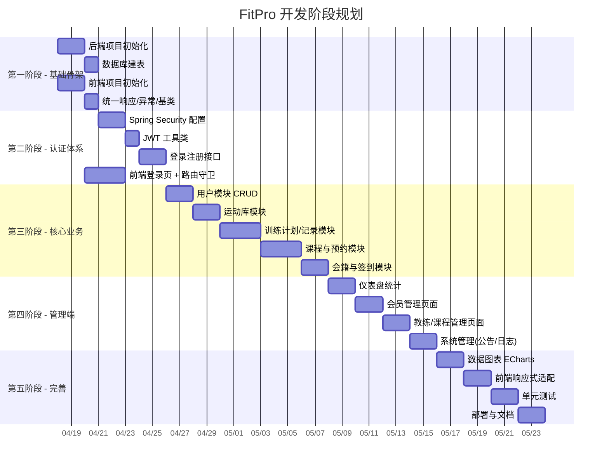

# FitPro 分阶段任务树

## 总览



---

## 第一阶段：项目骨架搭建 (3天)

### 目标：跑通前后端联调链路

```
Phase 1 - 基础骨架
├── 1.1 后端初始化 ✅
│   ├── [x] Spring Boot 3.2 项目创建 (Spring Initializr)
│   ├── [x] pom.xml 依赖配置 (MyBatis-Plus, Redis, Knife4j, Lombok, Hutool)
│   ├── [x] application.yml / application-dev.yml 配置
│   ├── [x] 多环境配置 (dev/prod)
│   └── [x] 启动类 FitnessApplication.java
├── 1.2 通用组件 ✅
│   ├── [x] Result.java 统一响应封装
│   ├── [x] PageResult.java 分页响应
│   ├── [x] BaseEntity.java 实体基类 (id, createdAt, updatedAt, deleted)
│   ├── [x] GlobalExceptionHandler 全局异常处理
│   ├── [x] BusinessException 自定义业务异常
│   └── [x] MybatisPlusConfig 分页插件/自动填充
├── 1.3 数据库 ✅
│   ├── [x] 创建 fitpro 数据库
│   ├── [x] 执行建表 SQL (19张表)
│   └── [x] 初始化种子数据 (管理员账号、运动分类)
├── 1.4 前端初始化 ✅
│   ├── [x] Vite + Vue 3 项目创建
│   ├── [x] Element Plus 引入与配置
│   ├── [x] Vue Router 基础路由
│   ├── [x] Pinia 状态管理
│   ├── [x] Axios 封装 (请求/响应拦截器, Token 注入)
│   ├── [x] 全局样式 / CSS 变量
│   └── [x] 基础布局组件 (AdminLayout / AppLayout)
└── 1.5 联调验证
    ├── [x] 后端 Knife4j 文档可访问
    ├── [x] 前端请求后端 /api/health 接口成功
    └── [x] CORS 跨域配置验证
```

## 第二阶段：认证与授权 (5天)

### 目标：完成登录注册、JWT鉴权、角色权限

```
Phase 2 - 认证体系
├── 2.1 后端安全 ✅
│   ├── [x] SecurityConfig.java (放行白名单, 角色配置)
│   ├── [x] JwtTokenProvider.java (生成/解析/刷新 Token)
│   ├── [x] JwtAuthFilter.java (请求拦截, Token 校验)
│   ├── [x] UserDetailsServiceImpl.java (加载用户信息)
│   ├── [x] RedisConfig.java (Token 存储)
│   └── [x] CorsConfig.java
├── 2.2 认证接口
│   ├── [x] POST /api/auth/register (注册)
│   ├── [x] POST /api/auth/login (登录)
│   ├── [x] POST /api/auth/refresh (刷新Token)
│   ├── [x] POST /api/auth/logout (登出)
│   └── [x] GET /api/auth/me (获取当前用户)
├── 2.3 前端认证
│   ├── [x] 登录页面 LoginView.vue
│   ├── [ ] 注册页面 RegisterView.vue
│   ├── [x] useAuthStore (Token管理, 用户状态)
│   ├── [~] 路由守卫 (未登录跳转, 角色权限)
│   ├── [ ] Axios 拦截器 (自动携带Token, 401处理)
│   └── [ ] Token 过期自动刷新逻辑
└── 2.4 验证
    ├── [ ] 注册 → 登录 → 访问受保护接口 流程通过
    ├── [ ] 不同角色访问权限验证
    └── [ ] Token 过期 → 刷新 → 重试 流程通过
```

```Mermaid
graph TB
    subgraph 路由层
        R1["/ - 登录页"]
        R2["/admin - 管理端布局"]
        R3["/app - 会员端布局"]
    end
subgraph 管理端页面
    R2 --> P1[Dashboard 仪表盘]
    R2 --> P2[会员管理]
    R2 --> P3[教练管理]
    R2 --> P4[课程管理]
    R2 --> P5[运动库管理]
    R2 --> P6[系统管理]
end

subgraph 会员端页面
    R3 --> P7[个人中心]
    R3 --> P8[课程预约]
    R3 --> P9[训练计划]
    R3 --> P10[签到打卡]
end

subgraph 状态管理_Pinia
    S1[useAuthStore]
    S2[useUserStore]
    S3[useCourseStore]
end

subgraph API_层
    A1[authApi]
    A2[userApi]
    A3[courseApi]
    A4[workoutApi]
    A5[exerciseApi]
    A6[membershipApi]
end

P1 & P2 & P3 & P4 & P5 & P6 & P7 & P8 & P9 & P10 --> S1 & S2 & S3
S1 & S2 & S3 --> A1 & A2 & A3 & A4 & A5 & A6
```

### 目标：完成所有业务 CRUD 和前端页面

```
Phase 3 - 核心业务
├── 3.1 用户模块 (2天)
│   ├── [ ] User Entity / DTO / VO
│   ├── [ ] UserMapper + XML
│   ├── [ ] UserService (CRUD, 分页查询, 修改密码)
│   ├── [ ] UserController (管理端+用户端接口)
│   ├── [ ] 个人中心页面 ProfileView.vue
│   └── [ ] 管理端-用户列表页面
├── 3.2 身体数据模块 (1天)
│   ├── [ ] BodyRecord Entity / DTO
│   ├── [ ] BodyRecordService (录入, 历史查询)
│   ├── [ ] BodyRecordController
│   └── [ ] 身体数据录入/历史页面
├── 3.3 运动库模块 (2天)
│   ├── [ ] ExerciseCategory + Exercise Entity
│   ├── [ ] ExerciseService (分类CRUD, 动作CRUD, 按肌群/器械筛选)
│   ├── [ ] ExerciseController
│   ├── [ ] 运动库浏览页面 (会员端)
│   └── [ ] 运动库管理页面 (管理端)
├── 3.4 训练模块 (3天)
│   ├── [ ] WorkoutTemplate / Plan / Record 全套 Entity
│   ├── [ ] WorkoutTemplateService (模板CRUD)
│   ├── [ ] WorkoutPlanService (计划制定, 按周展示)
│   ├── [ ] WorkoutRecordService (记录训练, 统计)
│   ├── [ ] 训练计划页面 (会员端, 按周日历展示)
│   ├── [ ] 训练记录页面 (会员端, 实时记录)
│   └── [ ] 训练模板管理 (管理端/教练端)
├── 3.5 课程与预约模块 (3天)
│   ├── [ ] Course / CourseSchedule / CourseBooking Entity
│   ├── [ ] CourseService (课程CRUD)
│   ├── [ ] CourseScheduleService (排课, 日历查询)
│   ├── [ ] CourseBookingService (预约, 取消, 容量控制)
│   ├── [ ] 课程列表/详情页面 (会员端)
│   ├── [ ] 排课日历页面 (管理端)
│   └── [ ] 预约管理页面 (管理端)
└── 3.6 会籍与签到模块 (2天)
    ├── [ ] MembershipCard / MemberMembership / CheckIn Entity
    ├── [ ] MembershipService (办卡, 续费, 冻结, 退卡)
    ├── [ ] CheckInService (签到, 记录查询)
    ├── [ ] 会籍信息页面 (会员端)
    ├── [ ] 签到打卡页面 (会员端)
    └── [ ] 会籍管理页面 (管理端)
```

## 第四阶段：管理端完善 (8天)

### 目标：管理后台全部页面和统计功能

```
Phase 4 - 管理端
├── 4.1 仪表盘 (2天)
│   ├── [ ] DashboardService (统计查询: 会员数/签到数/课程数/收入)
│   ├── [ ] DashboardController
│   ├── [ ] 数据卡片组件
│   ├── [ ] 趋势图表 (ECharts 折线图/柱状图)
│   └── [ ] 待办事项列表
├── 4.2 会员管理 (2天)
│   ├── [ ] 会员列表 (搜索/筛选/分页)
│   ├── [ ] 会员详情 (基本信息+会籍+训练+签到)
│   ├── [ ] 会籍操作 (办卡/续费/冻结/退卡 弹窗)
│   └── [ ] 签到记录查看
├── 4.3 教练与课程管理 (2天)
│   ├── [ ] 教练列表/详情
│   ├── [ ] 排课管理 (日历拖拽排课)
│   ├── [ ] 课程维护 (上下架/编辑)
│   └── [ ] 预约记录管理
└── 4.4 系统管理 (2天)
    ├── [ ] 公告管理 (发布/编辑/删除/置顶)
    ├── [ ] 操作日志 (AOP 自动记录 + 查询页面)
    └── [ ] 系统配置页面
```

## 第五阶段：优化与部署 (8天)

### 目标：完善体验、测试、部署上线

```
Phase 5 - 完善与部署
├── 5.1 数据可视化 (2天)
│   ├── [ ] 身体数据趋势图 (体重/体脂折线图)
│   ├── [ ] 训练统计图表 (训练量/频次)
│   ├── [ ] 仪表盘图表优化
│   └── [ ] 图表响应式适配
├── 5.2 前端体验优化 (2天)
│   ├── [ ] 移动端响应式适配
│   ├── [ ] 加载状态 / 骨架屏
│   ├── [ ] 空状态提示
│   ├── [ ] 消息通知组件
│   └── [ ] 表单校验完善
├── 5.3 测试 (2天)
│   ├── [ ] Service 层单元测试 (核心业务)
│   ├── [ ] Controller 层接口测试
│   ├── [ ] 前端组件测试 (可选)
│   └── [ ] 端到端流程测试
└── 5.4 部署 (2天)
    ├── [ ] Docker Compose 编排 (MySQL + Redis + Backend + Nginx)
    ├── [ ] Nginx 配置 (静态资源 + API 反代)
    ├── [ ] 前端打包优化 (gzip, 分包)
    └── [ ] README 部署文档
```

## 里程碑检查点

| 里程碑 | 完成标志 | 预计时间 |
|--------|----------|----------|
| M1 骨架就绪 | 前后端联调通、Swagger 可访问 | 第3天 |
| M2 认证打通 | 注册→登录→鉴权→刷新 全流程通过 | 第8天 |
| M3 核心业务 | 所有 CRUD 接口+页面完成 | 第20天 |
| M4 管理端完整 | 管理后台全部页面可用 | 第28天 |
| M5 可部署 | Docker 一键部署、文档齐全 | 第36天 |
