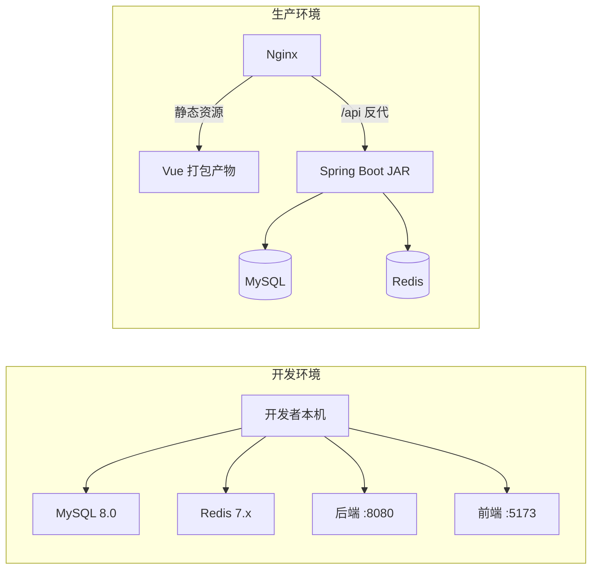

# 🏋️ FitPro 健身管理系统 — 需求与技术方案

## 1. 项目概述

### 1.1 项目背景

FitPro 是一个面向中小型健身房的综合管理系统，提供会员管理、课程预约、训练计划制定、身体数据追踪等核心功能。系统分为 **用户端（会员/教练）** 和 **管理端（管理员）**，采用前后端分离架构。

### 1.2 项目目标

| 目标           | 描述                                           |
| -------------- | ---------------------------------------------- |
| 🎯 核心目标    | 实现健身房日常运营数字化管理                   |
| 👥 目标用户    | 健身房管理员、健身教练、健身会员               |
| 📱 使用场景    | PC 端管理后台 + 移动端适配的会员前台           |
| 🎓 学习目标    | 掌握 Spring Boot + Vue 全栈开发实战能力        |

---

## 2. 功能需求

### 2.1 用户角色

```
┌─────────────────────────────────────────────┐
│              系统角色划分                      │
├──────────┬──────────┬───────────────────────┤
│  超级管理员  │   教练    │       会员            │
│ SUPER_ADMIN│  COACH   │      MEMBER          │
├──────────┼──────────┼───────────────────────┤
│ 全部权限    │ 课程管理  │ 个人信息管理           │
│ 用户管理    │ 训练计划  │ 课程预约              │
│ 系统配置    │ 会员指导  │ 训练记录              │
│ 数据统计    │ 排课查看  │ 身体数据追踪           │
└──────────┴──────────┴───────────────────────┘
```

### 2.2 功能模块总览

```mermaid
mindmap
  root((FitPro 健身管理系统))
    用户端
      认证模块
        注册
        登录
        找回密码
      个人中心
        个人信息
        身体数据
        数据趋势图
      训练模块
        训练计划
        训练记录
        运动库浏览
      课程模块
        课程列表
        课程预约
        预约记录
      会员服务
        会籍信息
        签到打卡
        消息通知
    管理端
      仪表盘
        数据概览
        趋势图表
        待办事项
      会员管理
        会员列表
        会籍管理
        签到记录
      教练管理
        教练列表
        排课管理
        绩效统计
      课程管理
        课程维护
        排课日历
        预约管理
      运动库管理
        动作分类
        动作维护
        训练模板
      系统管理
        公告管理
        系统配置
        操作日志
```

### 2.3 详细功能说明

#### 模块一：认证与授权

| 功能        | 描述                                       | 优先级 |
| ----------- | ------------------------------------------ | ------ |
| 用户注册    | 手机号/邮箱注册，填写基本信息              | P0     |
| 用户登录    | 账号密码登录，支持"记住我"                 | P0     |
| JWT 鉴权    | Token 自动刷新，角色权限控制               | P0     |
| 找回密码    | 通过邮箱验证码重置密码                     | P2     |

#### 模块二：个人中心

| 功能         | 描述                                      | 优先级 |
| ------------ | ----------------------------------------- | ------ |
| 个人信息管理 | 修改头像、昵称、联系方式等                | P0     |
| 身体数据录入 | 记录体重、体脂率、BMI、三围等             | P0     |
| 数据趋势图   | 以折线图展示身体数据变化趋势              | P1     |
| 目标设定     | 设定减脂/增肌/塑形目标及期限              | P1     |

#### 模块三：训练管理

| 功能         | 描述                                      | 优先级 |
| ------------ | ----------------------------------------- | ------ |
| 运动库       | 分类浏览动作库（按肌肉群/器械分类）      | P0     |
| 训练计划     | 教练为会员制定周训练计划                  | P0     |
| 训练记录     | 记录每次训练的动作、组数、重量、时长      | P0     |
| 训练统计     | 统计训练频次、总时长、训练量趋势          | P1     |

#### 模块四：课程与预约

| 功能         | 描述                                      | 优先级 |
| ------------ | ----------------------------------------- | ------ |
| 课程列表     | 展示团课信息（瑜伽、搏击、动感单车等）    | P0     |
| 排课日历     | 日历视图展示课程时间表                    | P0     |
| 课程预约     | 在线预约课程，支持取消预约                | P0     |
| 容量控制     | 课程人数上限控制，满员自动关闭预约        | P1     |

#### 模块五：会员管理（管理端）

| 功能         | 描述                                      | 优先级 |
| ------------ | ----------------------------------------- | ------ |
| 会员列表     | 查看/搜索/筛选会员信息                    | P0     |
| 会籍管理     | 办卡、续费、冻结、退卡操作                | P0     |
| 签到记录     | 查看会员到店签到历史                      | P1     |
| 会员画像     | 活跃度、消费、训练数据综合展示            | P2     |

#### 模块六：系统管理（管理端）

| 功能         | 描述                                      | 优先级 |
| ------------ | ----------------------------------------- | ------ |
| 仪表盘       | 会员总数、今日签到、课程数、收入等概览    | P0     |
| 公告管理     | 发布/编辑/删除系统公告                    | P1     |
| 操作日志     | 记录管理端关键操作日志                    | P2     |

---

## 3. 技术选型

### 3.1 技术栈总览

| 层次       | 技术                        | 版本    | 说明                     |
| ---------- | --------------------------- | ------- | ------------------------ |
| **后端框架** | Spring Boot                | 3.2.x   | 主体框架                 |
| **安全认证** | Spring Security + JWT      | —       | 权限认证                 |
| **ORM**     | MyBatis-Plus               | 3.5.x   | 数据持久层               |
| **数据库**   | MySQL                      | 8.0     | 主数据库                 |
| **缓存**     | Redis                      | 7.x     | Token/热数据缓存         |
| **接口文档** | Knife4j (Swagger)          | 4.x     | API 文档自动生成         |
| **前端框架** | Vue 3                      | 3.4.x   | 渐进式 JS 框架           |
| **构建工具** | Vite                       | 5.x     | 前端构建                 |
| **UI 框架**  | Element Plus               | 2.x     | 后台 UI 组件库           |
| **状态管理** | Pinia                      | 2.x     | Vue 状态管理             |
| **路由**     | Vue Router                 | 4.x     | 前端路由                 |
| **HTTP**     | Axios                      | 1.x     | HTTP 请求库              |
| **图表**     | ECharts                    | 5.x     | 数据可视化               |
| **工具**     | Lombok, Hutool, MapStruct  | —       | 后端工具库               |

### 3.2 项目结构

```
f:\Project\
├── fitness-backend/                 # Spring Boot 后端
│   ├── src/main/java/com/fitness/
│   │   ├── FitnessApplication.java  # 启动类
│   │   ├── config/                  # 配置类
│   │   │   ├── SecurityConfig.java
│   │   │   ├── CorsConfig.java
│   │   │   ├── MybatisPlusConfig.java
│   │   │   ├── RedisConfig.java
│   │   │   └── SwaggerConfig.java
│   │   ├── common/                  # 通用组件
│   │   │   ├── Result.java          # 统一响应
│   │   │   ├── PageResult.java      # 分页响应
│   │   │   ├── BaseEntity.java      # 实体基类
│   │   │   └── exception/           # 异常处理
│   │   ├── security/                # 安全模块
│   │   │   ├── JwtTokenProvider.java
│   │   │   ├── JwtAuthFilter.java
│   │   │   └── UserDetailsServiceImpl.java
│   │   ├── module/                  # 业务模块
│   │   │   ├── auth/                # 认证模块
│   │   │   ├── user/                # 用户模块
│   │   │   ├── exercise/            # 运动库模块
│   │   │   ├── workout/             # 训练模块
│   │   │   ├── course/              # 课程模块
│   │   │   ├── membership/          # 会员卡模块
│   │   │   ├── checkin/             # 签到模块
│   │   │   └── system/              # 系统模块
│   │   └── util/                    # 工具类
│   ├── src/main/resources/
│   │   ├── application.yml
│   │   ├── application-dev.yml
│   │   └── mapper/                  # MyBatis XML
│   └── pom.xml
├── fitness-frontend/                # Vue 3 前端
│   ├── src/
│   │   ├── api/                     # API 接口
│   │   ├── assets/                  # 静态资源
│   │   ├── components/              # 公共组件
│   │   ├── composables/             # 组合式函数
│   │   ├── layout/                  # 布局组件
│   │   ├── router/                  # 路由配置
│   │   ├── stores/                  # Pinia 状态
│   │   ├── styles/                  # 全局样式
│   │   ├── utils/                   # 工具函数
│   │   ├── views/                   # 页面视图
│   │   │   ├── auth/                # 登录注册
│   │   │   ├── dashboard/           # 仪表盘
│   │   │   ├── member/              # 会员相关
│   │   │   ├── exercise/            # 运动库
│   │   │   ├── workout/             # 训练计划
│   │   │   ├── course/              # 课程管理
│   │   │   ├── profile/             # 个人中心
│   │   │   └── system/              # 系统管理
│   │   ├── App.vue
│   │   └── main.js
│   ├── index.html
│   ├── vite.config.js
│   └── package.json
├── docs/                            # 项目文档
├── sql/                             # SQL 脚本
├── CLAUDE.md                        # AI 代码生成规范
└── README.md
```

---

## 4. 非功能性需求

| 类别     | 要求                                                 |
| -------- | ---------------------------------------------------- |
| 性能     | API 响应时间 < 500ms，列表页支持万级数据分页         |
| 安全     | 密码 BCrypt 加密，JWT Token 过期机制，XSS/CSRF 防护  |
| 可用性   | 前端响应式布局，兼容主流浏览器（Chrome/Edge/Firefox） |
| 可维护性 | 代码分层清晰，注释覆盖率 > 30%，统一异常处理         |
| 可测试性 | 核心 Service 层单元测试覆盖                          |

---

## 5. 部署方案



> **注意：** 开发阶段使用本地环境，生产环境可选用 Docker Compose 一键部署。
