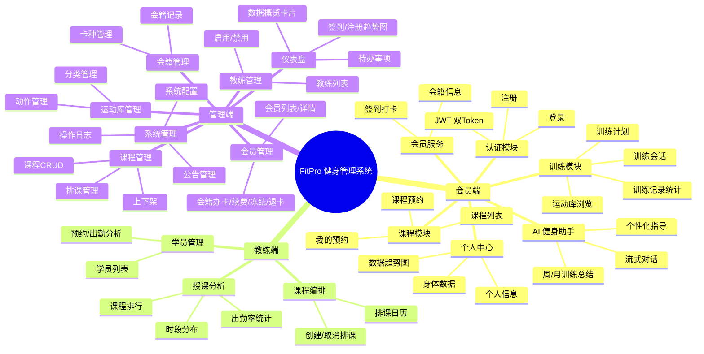
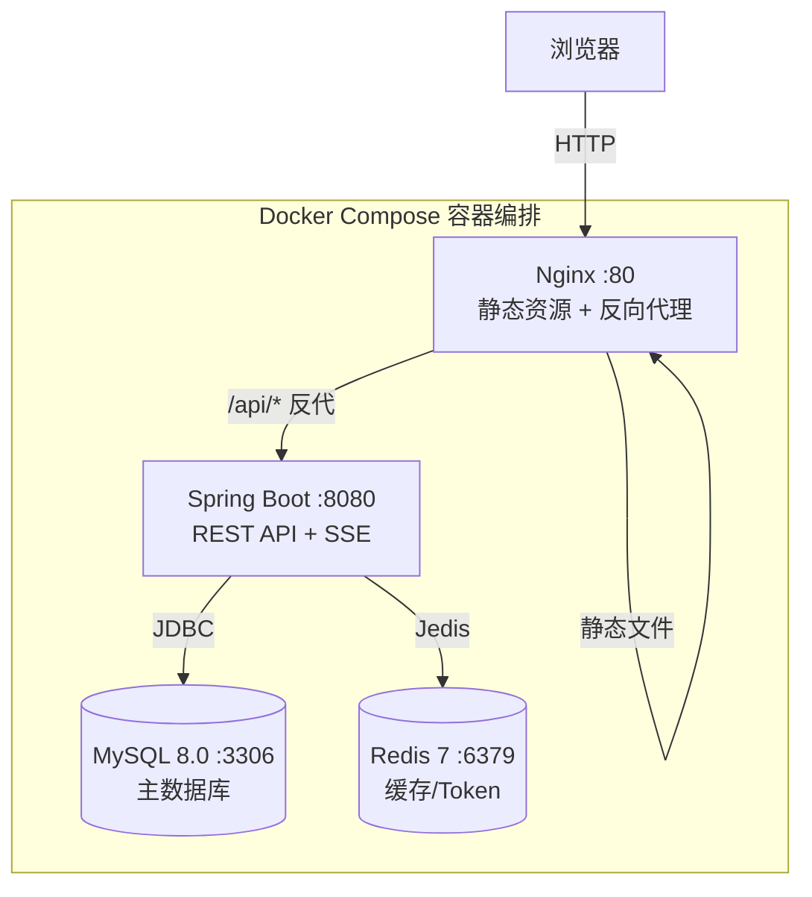

# 🏋️ FitPro 健身管理系统 — 需求与技术方案

## 1. 项目概述

### 1.1 项目背景

FitPro 是一个面向中小型健身房的综合管理系统，提供会员管理、课程预约、训练计划制定、身体数据追踪、AI 健身助手等核心功能。系统分为 **会员端**、**教练端** 和 **管理端** 三端，采用前后端分离架构。

### 1.2 项目目标

| 目标           | 描述                                           |
| -------------- | ---------------------------------------------- |
| 🎯 核心目标    | 实现健身房日常运营数字化管理                   |
| 👥 目标用户    | 健身房管理员、健身教练、健身会员               |
| 📱 使用场景    | PC 端管理后台 + 移动端适配的会员前台           |
| 🎓 学习目标    | 掌握 Spring Boot + Vue 全栈开发实战能力        |

---

## 2. 功能需求

### 2.1 用户角色

```
┌──────────────────────────────────────────────────┐
│                   系统角色划分                      │
├──────────────┬──────────────┬────────────────────┤
│  超级管理员     │     教练       │       会员         │
│ SUPER_ADMIN   │    COACH      │      MEMBER       │
├──────────────┼──────────────┼────────────────────┤
│ 仪表盘/数据统计 │ 课程编排/排课   │ 个人信息管理         │
│ 会员/教练管理   │ 授课分析/统计   │ 课程预约/取消        │
│ 课程/运动库管理 │ 学员管理/分析   │ 训练计划/会话/记录    │
│ 会籍/支付管理   │ 训练模板管理    │ 身体数据追踪/趋势     │
│ 公告/日志/配置  │               │ 会籍信息/签到打卡     │
│              │               │ AI 健身助手对话      │
└──────────────┴──────────────┴────────────────────┘
```

### 2.2 功能模块总览


```mermaid
mindmap
  root((FitPro 健身管理系统))
    会员端
      认证模块
        注册
        登录
        JWT 双Token
      个人中心
        个人信息
        身体数据
        数据趋势图
      训练模块
        训练计划
        训练会话
        训练记录统计
        运动库浏览
      课程模块
        课程列表
        课程预约
        我的预约
      会员服务
        会籍信息
        签到打卡
      AI 健身助手
        流式对话
        个性化指导
        周/月训练总结
    教练端
      课程编排
        排课日历
        创建/取消排课
      授课分析
        出勤率统计
        时段分布
        课程排行
      学员管理
        学员列表
        预约/出勤分析
    管理端
      仪表盘
        数据概览卡片
        签到/注册趋势图
        待办事项
      会员管理
        会员列表/详情
        会籍办卡/续费/冻结/退卡
      教练管理
        教练列表
        启用/禁用
      课程管理
        课程CRUD
        上下架
        排课管理
      运动库管理
        分类管理
        动作管理
      会籍管理
        卡种管理
        会籍记录
      系统管理
        公告管理
        操作日志
        系统配置
```

### 2.3 详细功能说明

#### 模块一：认证与授权

| 功能        | 描述                                       | 优先级 |
| ----------- | ------------------------------------------ | ------ |
| 用户注册    | 手机号/邮箱注册，填写基本信息              | P0     |
| 用户登录    | 账号密码登录，支持"记住我"                 | P0     |
| JWT 鉴权    | Token 自动刷新，角色权限控制               | P0     |
| 找回密码    | 通过邮箱验证码重置密码                     | P2     |

#### 模块二：个人中心

| 功能         | 描述                                      | 优先级 |
| ------------ | ----------------------------------------- | ------ |
| 个人信息管理 | 修改头像、昵称、联系方式等                | P0     |
| 身体数据录入 | 记录体重、体脂率、BMI、三围等             | P0     |
| 数据趋势图   | 以折线图展示身体数据变化趋势              | P1     |
| 目标设定     | 设定减脂/增肌/塑形目标及期限              | P1     |

#### 模块三：训练管理

| 功能         | 描述                                      | 优先级 |
| ------------ | ----------------------------------------- | ------ |
| 运动库       | 分类浏览动作库（按肌肉群/器械分类）      | P0     |
| 训练计划     | 教练为会员制定周训练计划                  | P0     |
| 训练记录     | 记录每次训练的动作、组数、重量、时长      | P0     |
| 训练统计     | 统计训练频次、总时长、训练量趋势          | P1     |

#### 模块四：课程与预约

| 功能         | 描述                                      | 优先级 |
| ------------ | ----------------------------------------- | ------ |
| 课程列表     | 展示团课信息（瑜伽、搏击、动感单车等）    | P0     |
| 排课日历     | 日历视图展示课程时间表                    | P0     |
| 课程预约     | 在线预约课程，支持取消预约                | P0     |
| 容量控制     | 课程人数上限控制，满员自动关闭预约        | P1     |

#### 模块五：会员管理（管理端）

| 功能         | 描述                                      | 优先级 |
| ------------ | ----------------------------------------- | ------ |
| 会员列表     | 查看/搜索/筛选会员信息                    | P0     |
| 会籍管理     | 办卡、续费、冻结、退卡操作                | P0     |
| 签到记录     | 查看会员到店签到历史                      | P1     |
| 会员画像     | 活跃度、消费、训练数据综合展示            | P2     |

#### 模块六：AI 健身助手（会员端）

| 功能         | 描述                                      | 优先级 |
| ------------ | ----------------------------------------- | ------ |
| 流式对话     | 基于 DeepSeek 大模型，SSE 流式实时回复    | P0     |
| 个性化指导   | 采集用户训练数据构建 System Prompt         | P0     |
| 训练分析     | 基于真实训练记录生成周/月训练总结          | P1     |
| 对话历史     | 保留最近 20 条对话上下文                  | P1     |

#### 模块七：教练端

| 功能         | 描述                                      | 优先级 |
| ------------ | ----------------------------------------- | ------ |
| 课程编排     | 教练创建个人排课，查看预约学员列表        | P0     |
| 授课分析     | 出勤率、热门课程排行、时段分布统计        | P1     |
| 学员管理     | 查看学员预约次数、出勤率、最近上课日期    | P1     |
| 训练模板     | 创建和管理训练计划模板                    | P1     |

#### 模块八：系统管理（管理端）

| 功能         | 描述                                      | 优先级 |
| ------------ | ----------------------------------------- | ------ |
| 仪表盘       | 会员总数、今日签到、课程数、收入等概览    | P0     |
| 公告管理     | 发布/编辑/删除系统公告                    | P1     |
| 操作日志     | 记录管理端关键操作日志                    | P2     |

---

## 3. 技术选型

### 3.1 技术栈总览

| 层次       | 技术                        | 版本    | 说明                     |
| ---------- | --------------------------- | ------- | ------------------------ |
| **后端框架** | Spring Boot                | 3.2.5   | 主体框架                 |
| **安全认证** | Spring Security + JWT      | —       | 双Token无状态认证        |
| **ORM**     | MyBatis-Plus               | 3.5.7   | 数据持久层               |
| **数据库**   | MySQL                      | 8.0     | 主数据库                 |
| **缓存**     | Redis                      | 7.x     | Token/热数据缓存         |
| **接口文档** | Knife4j (OpenAPI 3)        | 4.4.0   | API 文档自动生成         |
| **AI SDK**   | DeepSeek API (兼容OpenAI)  | —       | AI 健身助手推理引擎       |
| **前端框架** | Vue 3 (Composition API)    | 3.4.x   | 渐进式 JS 框架           |
| **构建工具** | Vite                       | 5.x     | 前端构建                 |
| **UI 框架**  | Element Plus               | 2.x     | 后台 UI 组件库           |
| **状态管理** | Pinia                      | 2.x     | Vue 状态管理             |
| **路由**     | Vue Router                 | 4.x     | 前端路由                 |
| **HTTP**     | Axios + Fetch API          | 1.x     | HTTP 请求库（SSE用Fetch） |
| **图表**     | ECharts                    | 5.x     | 数据可视化               |
| **工具**     | Lombok, Hutool 5.8.26      | —       | 后端工具库               |

### 3.2 项目结构

```
f:\Project\
├── docker-compose.yml               # 4服务编排（MySQL+Redis+Backend+Nginx）
├── Dockerfile                       # 后端多阶段构建（Maven编译+JRE运行）
├── fitness-backend/                 # Spring Boot 3.2 后端
│   ├── src/main/java/com/fitness/
│   │   ├── FitnessApplication.java  # 启动类（@MapperScan）
│   │   ├── config/                  # 配置类（8个）
│   │   │   ├── SecurityConfig.java  # Spring Security 无状态配置
│   │   │   ├── CorsConfig.java      # CORS 跨域
│   │   │   ├── MybatisPlusConfig.java # 分页+自动填充
│   │   │   ├── RedisConfig.java     # Redis 序列化
│   │   │   ├── JacksonConfig.java   # Long→String 防精度丢失
│   │   │   ├── SwaggerConfig.java   # Knife4j 文档
│   │   │   └── WebConfig.java       # 静态资源映射
│   │   ├── common/                  # 通用组件
│   │   │   ├── Result.java          # 统一响应 Result<T>
│   │   │   ├── PageResult.java      # 分页响应封装
│   │   │   ├── BaseEntity.java      # 实体基类（雪花ID+逻辑删除）
│   │   │   └── exception/           # BusinessException + GlobalExceptionHandler
│   │   ├── security/                # 安全模块
│   │   │   ├── JwtTokenProvider.java # JWT 双Token生成/校验
│   │   │   ├── JwtAuthFilter.java   # 请求JWT过滤器
│   │   │   └── UserDetailsServiceImpl.java
│   │   ├── module/                  # 业务模块（12个）
│   │   │   ├── auth/                # 认证（注册/登录/Token刷新）
│   │   │   ├── user/                # 用户 + 身体数据
│   │   │   ├── exercise/            # 运动分类 + 动作库
│   │   │   ├── workout/             # 训练模板/计划/记录（7表3级嵌套）
│   │   │   ├── course/              # 课程 + 排课 + 预约（乐观锁防超卖）
│   │   │   ├── membership/          # 卡种 + 会籍（办卡/续费/冻结）
│   │   │   ├── checkin/             # 签到打卡
│   │   │   ├── ai/                  # AI 健身助手（DeepSeek + SSE）
│   │   │   ├── coach/               # 教练端（排课/分析/学员）
│   │   │   ├── admin/               # 仪表盘统计
│   │   │   ├── payment/             # 支付订单
│   │   │   ├── file/                # 文件上传
│   │   │   └── system/              # 公告 + 操作日志（AOP）
│   │   └── util/                    # 工具类
│   ├── src/main/resources/
│   │   ├── application.yml          # 主配置（JWT/DeepSeek/MyBatis-Plus）
│   │   ├── application-dev.yml      # 开发环境
│   │   ├── application-prod.yml     # 生产环境
│   │   └── mapper/                  # 8个 MyBatis XML 映射文件
│   └── pom.xml                      # Maven 依赖管理
├── fitness-frontend/                # Vue 3.4 前端
│   ├── src/
│   │   ├── api/                     # 15个 API 模块（auth/admin/ai/course/...）
│   │   ├── assets/                  # 静态资源
│   │   ├── layout/                  # 3套布局（会员/教练/管理端）
│   │   │   ├── AppLayout.vue
│   │   │   ├── CoachLayout.vue
│   │   │   └── AdminLayout.vue
│   │   ├── router/                  # 路由（含角色守卫）
│   │   ├── stores/                  # Pinia Store（auth/course/...）
│   │   ├── styles/                  # 全局样式
│   │   ├── utils/
│   │   │   └── request.js           # Axios 封装（Token注入/自动刷新）
│   │   ├── views/                   # 35个页面视图
│   │   │   ├── auth/                # 登录/注册
│   │   │   ├── app/                 # 会员端（首页/个人中心/身体数据）
│   │   │   ├── admin/               # 管理端（仪表盘/会员/教练/课程/公告/日志）
│   │   │   ├── coach/               # 教练端（排课/分析/学员）
│   │   │   ├── ai/                  # AI 健身助手对话
│   │   │   ├── course/              # 课程列表/预约/排课管理
│   │   │   ├── workout/             # 训练计划/会话/记录/模板
│   │   │   ├── checkin/             # 签到打卡
│   │   │   ├── membership/          # 会籍信息/管理
│   │   │   ├── exercise/            # 运动库浏览/管理
│   │   │   ├── payment/             # 支付确认/结果
│   │   │   └── error/               # 404/403
│   │   ├── App.vue
│   │   └── main.js
│   ├── index.html
│   ├── vite.config.js               # Vite（自动导入/gzip/API代理）
│   └── package.json
├── nginx/conf.d/
│   └── fitpro.conf                  # Nginx 反向代理 + SSE 流式支持
├── sql/                             # SQL 脚本（建表+种子数据）
├── docs/                            # 项目文档/论文
└── README.md
```

---

## xxxxxxxxxx # 后端cd fitness-backendmvn package -DskipTestsjava -jar target/fitness-backend-*.jar​# 前端（使用 nginx 托管 dist 目录）cd fitness-frontendnpm install && npm run build# 将 dist/ 目录复制到 nginx html 目录bash

| 类别     | 要求                                                 |
| -------- | ---------------------------------------------------- |
| 性能     | API 响应 < 500ms，页面首次加载 < 2s，支持 50+ 并发   |
| 安全     | BCrypt 加密，JWT 双Token（2h/7d），RBAC 角色控制，SQL注入/XSS 防护 |
| 可用性   | 三端响应式布局（PC + 移动端），Chrome/Edge/Firefox 兼容 |
| 可维护性 | Controller→Service→Mapper 分层架构，统一异常处理，Knife4j 自动文档 |
| 可测试性 | 后端 91 个单元测试（5 Service + 3 Controller + E2E），前端 25 个测试 |

---

## 5. 部署方案

### 5.1 容器化部署（Docker Compose）


```mermaid
graph TB
    subgraph Docker[Docker Compose 容器编排]
        Nginx[Nginx :80<br/>静态资源 + 反向代理]
        Backend[Spring Boot :8080<br/>REST API + SSE]
        MySQL[(MySQL 8.0 :3306<br/>主数据库)]
        Redis[(Redis 7 :6379<br/>缓存/Token)]
    end

    Browser[浏览器] -->|HTTP| Nginx
    Nginx -->|/api/* 反代| Backend
    Nginx -->|静态文件| Nginx
    Backend -->|JDBC| MySQL
    Backend -->|Jedis| Redis
```

| 服务 | 镜像 | 端口映射 | 说明 |
|------|------|---------|------|
| mysql | mysql:8.0 | 3307:3306 | utf8mb4，自动执行 sql/ 初始化脚本 |
| redis | redis:7 | 6380:6379 | 无密码 |
| backend | 自构建（多阶段） | 8080:8080 | Spring Boot JAR，环境变量注入配置 |
| frontend | nginx:alpine | 80:80 | 静态资源 + API 反向代理 |

### 5.2 关键配置

- **Nginx**：`proxy_buffering off` 支持 AI 对话 SSE 流式传输，`proxy_read_timeout 300s`
- **Dockerfile**：多阶段构建（Maven 编译 → JRE 运行），镜像体积约 200MB
- **环境变量**：`SPRING_PROFILES_ACTIVE`、`DB_HOST`、`REDIS_HOST`、`DEEPSEEK_API_KEY`
